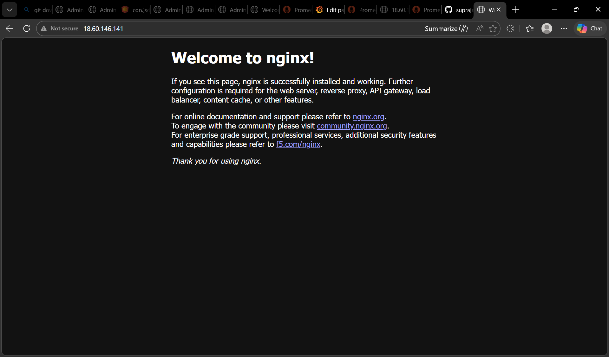
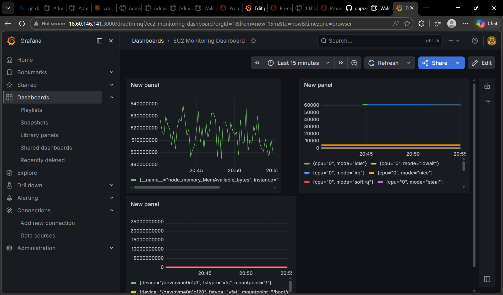
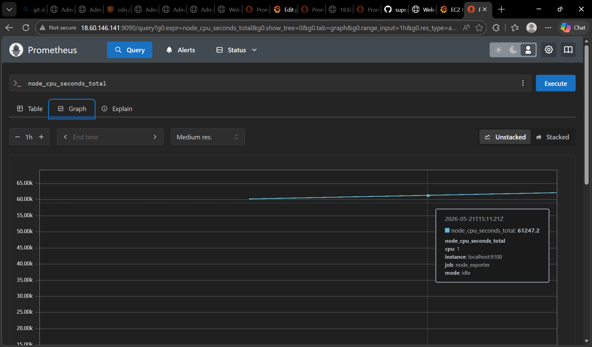
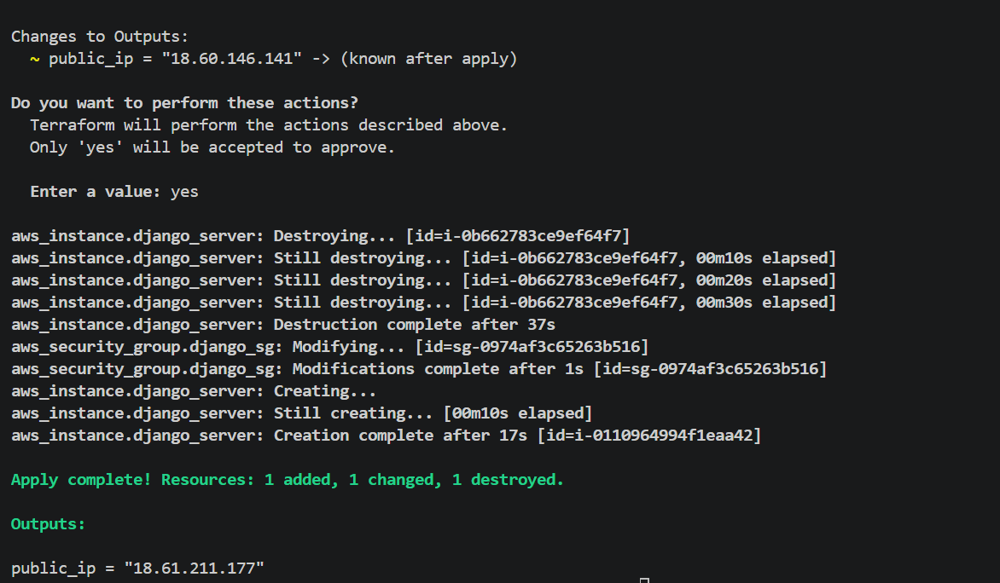
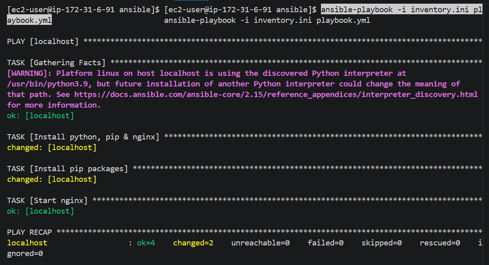

# 🚀 Anonymous Suggestion System (DevOps Project)

## 📌 Project Overview

This project is a **Django-based web application** deployed on AWS EC2 with a complete **DevOps pipeline**.

Users can submit anonymous suggestions, and the application is deployed with production-ready setup and monitored using modern DevOps tools.

---

## 🏗️ Architecture
User 🌐
↓
Nginx (Reverse Proxy)
↓
Gunicorn (Application Server)
↓
Django Application
↓
EC2 Instance (AWS)
↓
Node Exporter
↓
Prometheus
↓
Grafana Dashboard

---

## 🛠️ Technologies Used

### 🔹 Backend
- Django (Python)

### 🔹 Infrastructure
- AWS EC2
- Terraform (Infrastructure as Code)

### 🔹 Automation
- Ansible

### 🔹 Deployment
- Gunicorn
- Nginx

### 🔹 Monitoring
- Node Exporter
- Prometheus
- Grafana

---

## ⚙️ Features

- ✅ Anonymous suggestion submission  
- ✅ Django web interface  
- ✅ Production deployment setup  
- ✅ Infrastructure automation using Terraform  
- ✅ Configuration automation using Ansible  
- ✅ Real-time monitoring using Grafana  
- ✅ CPU, Memory, and Disk monitoring  

---
## 🚀 Setup Guide

### 1. Clone Repository

```bash
git clone https://github.com/YOUR_USERNAME/anonymous-suggestion-system.git
cd anonymous-suggestion-system


2. Provision Infrastructure
Shellcd terraformterraform initterraform applyShow more lines

3. Connect to EC2
Shellssh -i "your-key.pem" ec2-user@your-public-ip``Show more lines

4. Run Application
Shellpip install -r requirements.txtpython manage.py migratepython manage.py runserver 0.0.0.0:8000``Show more lines

5. Deploy with Gunicorn & Nginx

Configure Gunicorn
Configure Nginx as reverse proxy


6. Automate with Ansible
Shellansible-playbook -i ansible/inventory.ini ansible/playbook.ymlShow more lines

7. Monitoring Setup
Start Node Exporter
Shell./node_exporterShow more lines
Start Prometheus
Shell./prometheus --config.file=prometheus.ymlShow more lines
Start Grafana
Shellsudo systemctl start grafana-serverShow more lines

📊 Monitoring Dashboard
Using Grafana, we visualize:

✅ CPU Usage
✅ Memory Usage
✅ Disk Usage

🔥 Key Learnings

Infrastructure provisioning using Terraform
Automation using Ansible
Production deployment using Nginx & Gunicorn
Monitoring using Prometheus and Grafana
Debugging real-world DevOps issues

## 📸 Screenshots

### 🌐 Application


### 📊 Grafana Dashboard


### 📈 Prometheus


### ⚙️ Terraform


### 🤖 Ansible


💼 Use Case
This project demonstrates a complete DevOps lifecycle from development to deployment and monitoring.

👩‍💻 Author
Supraja Gollapalli
